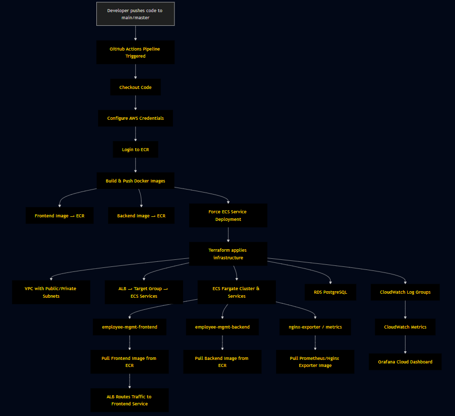
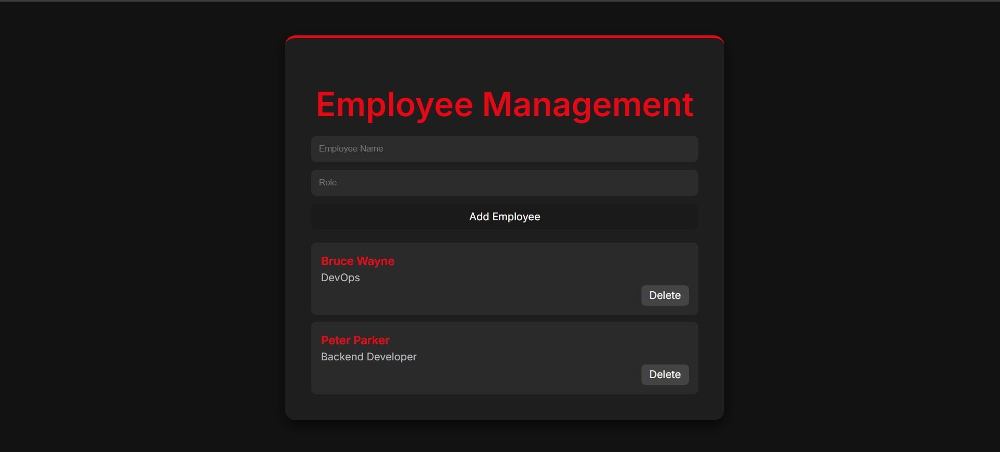
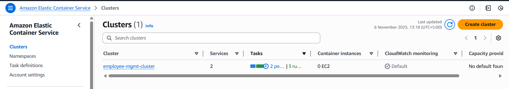
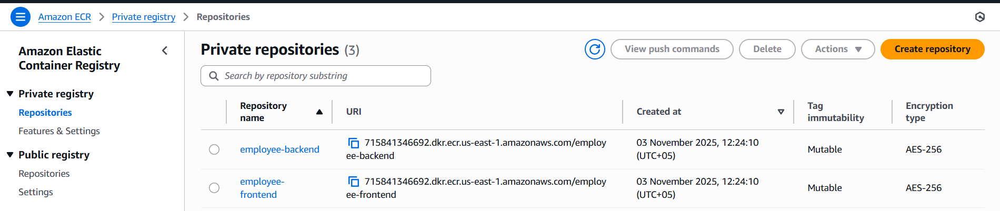
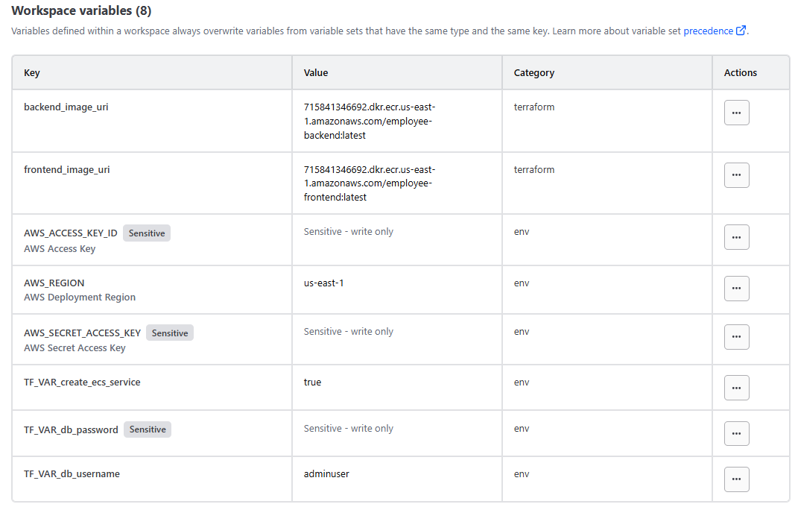
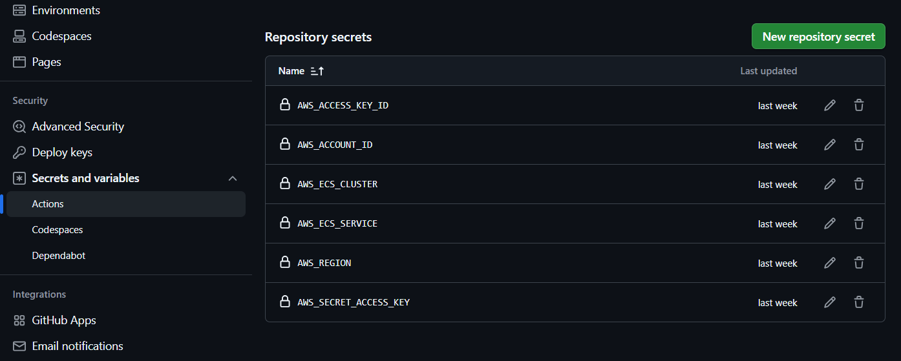
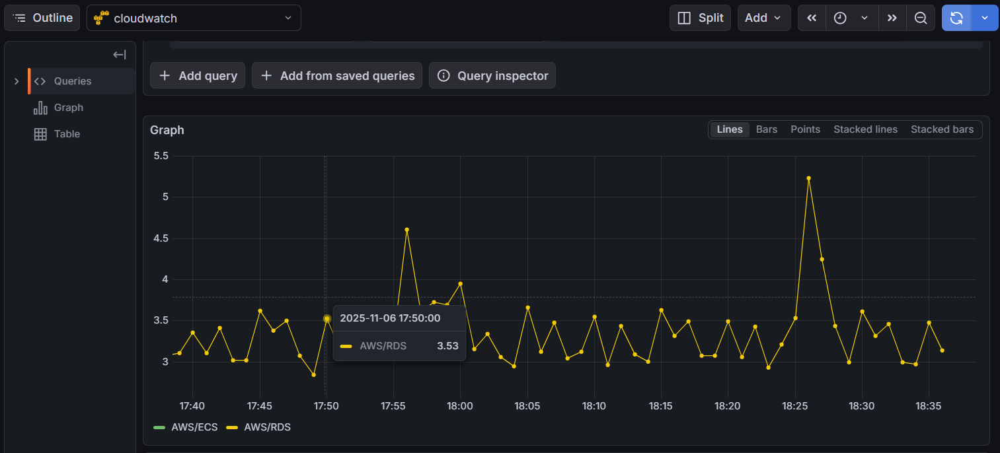

# Employee Management — Observability & Deployment Project

## Short Summary
This repository demonstrates a **microservices application** (frontend and backend) deployed on **AWS ECS Fargate**, backed by **RDS PostgreSQL**, with Docker images stored in **ECR**, infrastructure provisioned via **Terraform**, CI/CD automated with **GitHub Actions**, and monitoring through **AWS CloudWatch** integrated with **Grafana Cloud**.

**Author:** Osama  
**Tech Stack:** Terraform, AWS (VPC, ECS, ECR, ALB, RDS, CloudWatch), Docker, GitHub Actions, Grafana Cloud  

---

## Table of Contents
1. [Architecture](#architecture)
2. [Quick Start / Overview](#quick-start--overview)
3. [Infrastructure (Terraform)](#infrastructure-terraform)
4. [CI/CD (GitHub Actions)](#cicd-github-actions)
5. [Monitoring & Observability](#monitoring--observability)
6. [Screenshots](#screenshots)
7. [Troubleshooting](#troubleshooting)
8. [Contributing](#contributing)
9. [Changelog & Releases](#changelog--releases)
10. [License](#license)

---

## Architecture

### Architecture Diagram

### High-Level Flow
1. Git push to `main/master` triggers GitHub Actions pipeline.
2. Pipeline builds Docker images for frontend, backend, and Prometheus, then pushes them to **ECR**.
3. Terraform deploys/updates AWS infrastructure:  
   `VPC → Subnets → ALB → ECS Cluster & Services → RDS`.
4. ECS tasks pull images from **ECR**; ALB routes traffic to frontend.

---

## Quick Start / Overview
To reproduce or inspect the project:

- **Terraform files:** `terraform/`
- **CI pipeline:** `.github/workflows/pipeline.yaml`
- **Dockerfiles:** `frontend/Dockerfile`, `backend/Dockerfile`

**Important runtime environment variables (GitHub Secrets for Actions):**  
- `AWS_ACCESS_KEY_ID`  
- `AWS_SECRET_ACCESS_KEY`  
- `AWS_REGION`  
- `AWS_ACCOUNT_ID`  
- `AWS_ECS_CLUSTER`  
- `AWS_ECS_SERVICE`  

---

## Infrastructure (Terraform)

### Key Resources
- **VPC** with public/private subnets, NAT gateway  
- **ALB** (public) → Target group → ECS service (frontend)  
- **ECS Fargate cluster** + services:
  - `employee-mgmt-service` (frontend + backend + nginx-exporter)  
- **ECR Repositories:** `employee-frontend`, `employee-backend`, `prometheus`  
- **RDS Postgres instance**  
- **CloudWatch log group:** `/ecs/<name>`  

### Files to Review
- `terraform/main.tf`  
- `terraform/variables.tf`  
- `terraform/outputs.tf`  

### Notes
- ECS Task Execution Role must have:
  - `AmazonECSTaskExecutionRolePolicy`  
  - `AmazonEC2ContainerRegistryReadOnly`  
- ECS tasks in private subnets require NAT gateway to pull images (unless using public ECR or VPC endpoints).

---

## CI/CD (GitHub Actions)

### Pipeline Steps
1. **Checkout code:** `actions/checkout@v4`  
2. **Configure AWS credentials:** `aws-actions/configure-aws-credentials@v3`  
3. **Login to ECR:** `aws-actions/amazon-ecr-login@v1`  
4. **Build & push images:** `docker/build-push-action@v4` for frontend, backend, Prometheus  
5. **Deploy ECS service:** `aws ecs update-service --force-new-deployment`  

**Secrets used:**  
- `AWS_ACCESS_KEY_ID`  
- `AWS_SECRET_ACCESS_KEY`  
- `AWS_REGION`  
- `AWS_ACCOUNT_ID`  

---

## Monitoring & Observability
- **CloudWatch** is used as the primary source for metrics.  
- Metrics are visualized on **Grafana Cloud** dashboards for observability.

---

## Screenshots
**Project UI**

**AWS Cloud Snippets**

**Github Repo and Terraform Cloud secrets**

**Graffana Cloud Dasboard Visual**

---

## Troubleshooting
- Ensure ECS task role permissions are correct.  
- Verify NAT Gateway for private subnets if ECS tasks fail pulling images.  
- Check CloudWatch logs for task/container errors.

---

 
